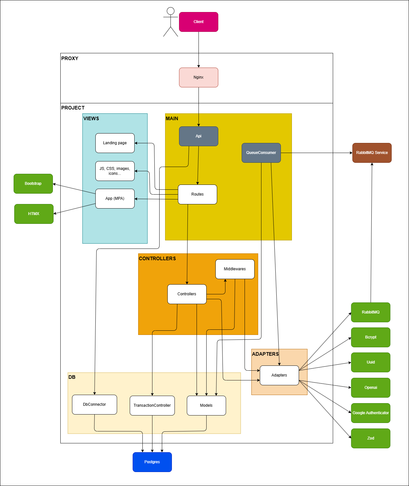

# EducaIA

EducaIA é um aplicativo web que ajuda nos estudos a partir de flashcards gerados e gerenciados com repetição espaçada. O usuário envia conhecimento e anotações em texto, o agente de IA transforma esse material em flashcards, e o aplicativo controla o ciclo de revisões de forma dinâmica a partir do feedback dado em cada sessão.

## Telas principais
Algumas telas para visualizar o fluxo do app:
- 
- 
- 
- 
- 
- 
- 
- 
- 

## Funcionalidades principais
- Criação e gerenciamento de baralhos de flashcards para diferentes tópicos de estudo.
- Conversão automática de textos e anotações em flashcards por meio de um agente de IA (LLM via API da OpenAI).
- Revisão espaçada com base no feedback do usuário para ajustar a próxima aparição de cada cartão.
- Interface web baseada em templates EJS com Bootstrap e HTMX, retornando sempre HTML ou trechos de HTML (API hypermedia-first).

## Arquitetura e stack
- Padrão MVC com separação entre *models*, *controllers* e *views*.
- Backend em Node.js com TypeScript.
- Banco de dados PostgreSQL.
- Frontend com EJS + Bootstrap + HTMX.
- Integração com LLM (OpenAI API) para geração de flashcards.
- TDD aplicado com Jest nos módulos mais críticos e nos *wrappers* de serviços e bibliotecas externas.
- Diagrama geral em `docs/diagrams/app_architecture.png`.
- Arquitetura com fila RabbitMQ para processar pedidos de geração de flashcards de forma assíncrona.
- Deploy com duas réplicas do app em Docker para melhorar throughput do consumo da fila e manter a API responsiva.
- Senhas armazenadas com hash (bcrypt) para proteger credenciais.
- Sessão autenticada via JWT enviado em cookie seguro, mantendo o estado de forma compatível com execução serverless e reautenticando automaticamente no navegador.

### Diagrama de arquitetura

## Configuração do ambiente
1. Copie o arquivo `.env.example` para `.env` e preencha as variáveis necessárias.
2. Suba o ambiente com Docker:
   - Ambiente de desenvolvimento: `make up-dev` para iniciar e `make down-dev` para parar.
   - Ambiente de produção: `make up` para iniciar e `make down` para parar.

## Desenvolvimento e testes
- O projeto é baseado em Node.js + TypeScript; use os scripts do `package.json` conforme necessário (instalação de dependências, lint, testes, etc.).
- Testes críticos são escritos com Jest. Execute-os conforme a necessidade do desenvolvimento.

## Fluxo de revisão dos flashcards
1. O usuário cria ou importa um conjunto de notas em texto.
2. O agente de IA converte o material em flashcards e os associa a um baralho.
3. Durante as sessões de estudo, o usuário fornece feedback sobre cada cartão.
4. O aplicativo agenda a próxima aparição de cada flashcard seguindo a lógica de repetição espaçada.

## Referências rápidas
- Arquitetura: `docs/diagrams/app_architecture.png`.
- Subir ambiente: `make up-dev`.
- Parar ambiente: `make down-dev`.
